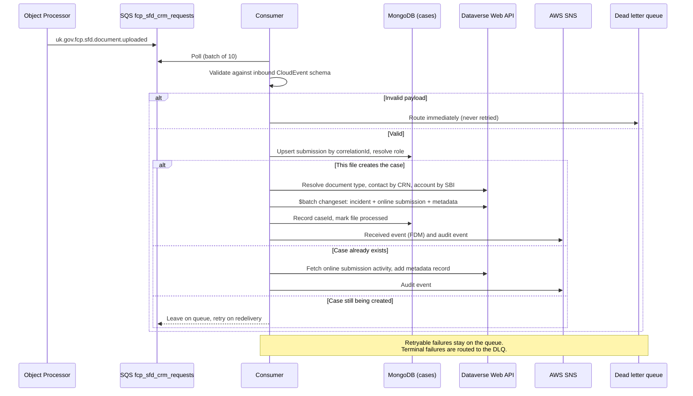
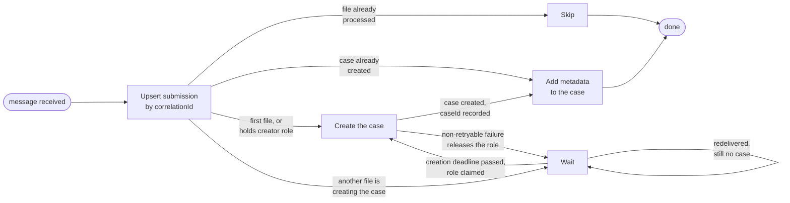

# fcp-sfd-crm


[](https://sonarcloud.io/summary/new_code?id=DEFRA_fcp-sfd-crm)
[](https://sonarcloud.io/summary/new_code?id=DEFRA_fcp-sfd-crm)
[](https://sonarcloud.io/summary/new_code?id=DEFRA_fcp-sfd-crm)

CRM orchestration service for Single Front Door.
This service is part of the [Single Front Door (SFD)](https://github.com/defra/fcp-sfd-core) service.

## Overview

This service turns document upload events into cases in Dataverse (Dynamics CRM). It consumes `uk.gov.fcp.sfd.document.uploaded` CloudEvents from an SQS queue, published by [fcp-sfd-object-processor](https://github.com/DEFRA/fcp-sfd-object-processor), resolves the farmer's contact and organisation records, and writes the case, its online submission activity and one metadata record per file. It then publishes a received event for the Farming Data Model and audit events to the shared audit topic.

The two properties that shape most of the code are that a submission may arrive as several messages which must converge on **one** case, and that a redelivered message must never create a second case.

## Architecture

### Message flow



### Multi-file convergence

Each message competes for a single *creator* role per `correlationId`, held in one MongoDB document. Only the creator writes the case; the rest attach their own metadata to it once it exists.



`claimCreatorRole` is a single conditional update matching at most one document, so two files can never both win the role. Case creation is idempotent regardless, so even a lost race commits only one incident.

### Idempotency

Cases are written as a Dataverse `$batch` changeset of `PATCH` requests carrying `If-None-Match: '*'`, against record IDs derived deterministically from the `correlationId` and `fileId`.

A redelivered message therefore resolves to the same record IDs and is rejected by Dataverse as already existing, rather than creating a duplicate. 

The reasoning and the alternatives considered are in [Use a Dataverse $batch changeset of conditional upserts instead of a deep insert for case creation](https://eaflood.atlassian.net/wiki/x/c4ACiAE).

Partial submissions are accepted rather than discarded when some files fail. See [Accept a partial submission rather than discarding the whole upload when one file fails](https://eaflood.atlassian.net/wiki/x/NoBziAE).

### Layered architecture

```
src/messaging/    → SQS consumer (inbound), SNS publishing (outbound), DLQ routing
src/services/     → Case orchestration, creator role, CRM helpers
src/repos/        → Dataverse Web API calls, batch changesets, Mongo cases collection
src/auth/         → CRM token acquisition (federated credentials or client secret)
src/api/schemas/  → Joi schemas for inbound, outbound and HTTP payloads
src/http/         → Outbound HTTP clients with retry policy
src/config/       → Convict configuration, split by concern
src/logging/      → Pino/ECS logger, correlation ID store, tenant message redaction
src/data/         → MongoDB client and index creation
src/constants/    → Shared enums and literals
```

### Contracts

The message this service consumes is defined in [`docs/asyncapi/v1.yml`](docs/asyncapi/v1.yml). Requests against the Dataverse Web API can be exercised directly using the Bruno collection in [fcp-sfd-core](https://github.com/DEFRA/fcp-sfd-core/tree/main/resources/bruno/collections/CRM), which mirrors the changeset logic in [`src/repos/crm.js`](src/repos/crm.js).

## Prerequisites

### Environment variables

Create a `.env` file in the root of the project based on `.env.example`.

CRM uses federated credentials when `CRM_AUTH_FEDERATED_AUDIENCE` is configured.
Set `CRM_AUTH_FEDERATED_DISABLED=true` to opt out and use the client-credentials
flow with `CRM_AUTH_ENDPOINT` and `CRM_AUTH_CLIENT_SECRET` instead. The flag
defaults to `false` so existing authentication behaviour is unchanged.

Set `CRM_WRITE_FILES_IN_SUBMISSION=true` to enable writing
`rpa_filesinsubmission` on online-submission records, defaults to
`false`.

Terminal inbound failures can be written to CRM triage records in
`rpa_integrationinboundqueues` for operations follow-up. Set `CRM_INTEGRATION_INBOUND_FAILURE_PROCESSING_ENTITY=927350008` to enable
these triage writes and bind that value to `rpa_processingentity` on the
triage record. Leave the value empty to opt out of triaging.

### Pre-commit hooks

This repo includes pre-commit hooks:
- **detect-secrets** — scans for accidentally committed secrets
- **eslint-fix** — runs ESLint with neostandard and `--fix`

Committing via the command line shows full hook output.

To install the pre-commit framework, you need Python and pip:

```bash
pip3 install pre-commit
```

Then activate the hooks:

```bash
pre-commit install
```

## Local development

### VS Code tasks

VS Code users can access tasks via the Command Palette → **Tasks: Run Task**.

- macOS: `Cmd+Shift+P`
- Windows: `Ctrl+Shift+P`

### Floci

The following instructions relate to interacting with Floci locally (outside of the Docker container) on host port `localhost:4566`.

Prerequisites:
- Docker stack is running (`npm run docker:dev`)
- AWS CLI is installed (`aws --version`)

Set these variables in your terminal session:

```bash
export AWS_ACCESS_KEY_ID=test
export AWS_SECRET_ACCESS_KEY=test
export AWS_ENDPOINT_URL=http://localhost:4566
export AWS_REGION=eu-west-2
```

#### Examples

List queues:
```bash
aws sqs list-queues --endpoint-url http://localhost:4566
```

List topics:
```bash
aws sns list-topics --endpoint-url http://localhost:4566
```

Check approximate message counts on a queue:
```bash
aws sqs get-queue-attributes \
	--queue-url http://localhost:4566/000000000000/fcp_sfd_crm_requests \
	--attribute-names ApproximateNumberOfMessages ApproximateNumberOfMessagesNotVisible
```

Read a message (without deleting it):
``` bash
aws sqs receive-message \
	--queue-url http://localhost:4566/000000000000/fcp_sfd_crm_requests \
	--max-number-of-messages 1
```

Purge all messages from a queue:
```bash
aws sqs purge-queue \
	--queue-url http://localhost:4566/000000000000/fcp_sfd_crm_requests
```

Note: use `http://localhost:4566` from your host shell. The `http://floci:4566` endpoint is only resolvable from within the Docker container(s).

## Building and starting the service

This service has been configured to run in a Docker container and it is recommended to utilise Docker and Docker Compose for local development.

Build the container:

```bash
npm run docker:build
```

Start the container:

```bash
npm run docker:dev
```

Start the container in detached mode:

```bash
npm run docker:dev:d
```

Stop the container:

```bash
npm run docker:stop
```

Stop the container and delete volumes:

```bash
npm run docker:stop:v
```

## Debugging

Start in debug mode:

```bash
npm run docker:debug
```

Debug port: `9232`. Attach via VS Code or Chrome DevTools.

## Testing

Tests are configured to run in Docker.

Start the test container:

```bash
npm run docker:test
```

The test container can also be started in watch mode to support Test Driven Development (TDD):

```bash
npm run docker:test:watch
```

Direct local execution with `npm run test` or `npm run test:watch` is not a supported workflow unless you manually provide all required environment variables in your shell.

## Linting

Run the linter (neostandard):

```bash
npm run lint
```

Auto-fix linting issues:

```bash
npm run lint:fix
```

## SonarQube Cloud scan

Run a local scan against [SonarCloud](https://sonarcloud.io/project/overview?id=DEFRA_fcp-sfd-crm) for the current git branch. See the [DEFRA SonarCloud guide](https://github.com/DEFRA/cdp-documentation/blob/main/how-to/sonarcloud.md) for organisation access and CI setup.

### Setup

1. Log in to [SonarQube Cloud](https://sonarcloud.io) with your DEFRA GitHub account
2. Go to **My Account → Security → Generate Tokens** and create a personal token
3. Add `SONAR_TOKEN=<your-token>` to your `.env` file
4. Ensure Docker is running

### Run

Generate test coverage first, then scan:

```bash
npm run docker:test
npm run sonar
```

The script uploads results for the current branch and prints:

- Quality gate pass/fail and failed conditions
- Open issues on new code (when the gate fails)
- **Accepted / false-positive issues without comment** — DEFRA quality gates require a justification comment on each suppressed issue; add comments in SonarCloud under the issue **Activity** tab

Exit code is `0` when the gate passes and all suppressed issues are commented, `1` otherwise.

## HTTP Retry

Outbound HTTP calls (CRM API and auth token requests) use [`@fetchkit/ffetch`](https://github.com/fetch-kit/ffetch) with configurable retry and exponential backoff.

### Error classification

| Category | Triggers | Behaviour |
|---|---|---|
| `retryable` | 5xx responses, 429 Too Many Requests, network errors (`ECONNREFUSED`, `ETIMEDOUT`, etc.), timeout | Retried up to `HTTP_RETRY_MAX_ATTEMPTS` |
| `nonRetryable` | 4xx responses (excluding 429), user abort | Not retried — fails immediately |
| `unknown` | Unrecognised/unexpected errors | Retried up to `RETRY_UNKNOWN_MAX_ATTEMPTS` (conservative budget) |

### Retry metadata

The HTTP client preserves existing success response contracts. For terminal thrown errors (for example, timeout/network failures), the error is enriched with:

- `error.retryMetadata.attempts`
- `error.retryMetadata.category` (`retryable`, `non-retryable`, `unknown`)
- `error.retryMetadata.terminalReason`

Retry decisions, terminal failures, and retry recovery are logged from the HTTP client layer using ECS-style `event.*` fields.

### Configuration

| Variable | Default | Description |
|---|---|---|
| `HTTP_RETRY_MAX_ATTEMPTS` | `3` | Total attempts (including first) for retryable errors |
| `CRM_TRIAGE_HTTP_RETRY_MAX_ATTEMPTS` | `1` | Total attempts (including first) for best-effort triage record writes |
| `HTTP_RETRY_BASE_DELAY_MS` | `500` | Initial backoff delay in milliseconds |
| `HTTP_RETRY_BACKOFF_MULTIPLIER` | `1.5` | Multiplier applied each retry (500 → 750 → 1125 ms) |
| `HTTP_RETRY_JITTER_PERCENTAGE` | `15` | ±% random jitter added to each delay to avoid thundering herd |
| `HTTP_RETRY_MAX_DELAY_MS` | `15000` | Hard cap on any single retry delay |
| `CRM_HTTP_TIMEOUT_MS` | `30000` | Per-attempt timeout for CRM API calls |
| `CRM_AUTH_HTTP_TIMEOUT_MS` | `5000` | Per-attempt timeout for auth/token requests |
| `CRM_TRIAGE_HTTP_TIMEOUT_MS` | `5000` | Per-attempt timeout for best-effort triage record writes |
| `RETRY_UNKNOWN_MAX_ATTEMPTS` | `2` | Total attempts for unknown errors (1 retry) |
| `RETRY_UNKNOWN_MAX_DELAY_MS` | `10000` | Hard cap on unknown-error retry delays |

Three clients are exported: `httpClient` (CRM API), `authHttpClient` (token endpoint), and `triageHttpClient` (best-effort triage writes). The triage client has its own timeout and attempt budget.

See [`src/config/retry.js`](src/config/retry.js) and [`src/http/client.js`](src/http/client.js) for implementation details.

## Message failure handling

HTTP retry governs a single outbound call. A second, independent layer decides what becomes of the inbound SQS message once processing has failed. Every failure ends one of two ways in [`src/messaging/inbound/consumer.js`](src/messaging/inbound/consumer.js): the message is left on the queue for another delivery, or it is copied to the dead letter queue and deleted from the main queue.

### Retryable versus terminal

The decision is made by [`isTerminalFailure`](src/utils/is-terminal-failure.js), which is simply `!err?.retryable`. A failure is retried only when the error carries an explicit `retryable = true`. An error that never sets the flag is terminal by default, so a thrown `Error` with no classification is discarded rather than replayed indefinitely.

Services set the flag deliberately. A CRM call whose HTTP classification came back as `retryable` is rethrown as retryable (see [`src/services/crm-helpers.js`](src/services/crm-helpers.js) and [`src/services/create-case-with-online-submission-in-crm.js`](src/services/create-case-with-online-submission-in-crm.js)). So are two waiting states: a file waiting for another file's case creation to finish, and an online submission that is not yet queryable after the case was created. Everything else, including a Boom 400 from parameter assertion and a Boom 422 from contact and account resolution, is terminal.

| Failure | Action | Log `event.type` |
|---|---|---|
| Body is not valid JSON | Dead letter queue | `crm.dlq.message_received` (`error.type: invalid_json`) |
| Payload fails the inbound CloudEvent schema | Dead letter queue | `crm.dlq.message_received` (`error.type: schema_invalid`) |
| Error with `retryable = true` | Left on queue for redelivery | `crm_case_creation_retryable`, `event.action: leave_on_queue` |
| Any other processing error | Dead letter queue | `crm_case_creation_failed` or `crm_metadata_attachment_failed`, `event.action: discard_message` |

Schema validation failures are always terminal. The payload is validated against [`inboundCloudEventSchema`](src/api/schemas/inbound.js) with `convert: false` and `abortEarly: false`, the full set of field errors is logged, and the message goes straight to the dead letter queue. A malformed message cannot become well formed on redelivery, so retrying it would only consume the redelivery budget.

A message replayed from the dead letter queue is recognised by the `replayed_from` message attribute and logged as `crm.dlq.message_replayed` before processing. If the send to the dead letter queue itself fails, `crm.dlq.send_failed` is logged at `fatal` and the message is still deleted from the main queue.

### Redelivery budget

Retryable failures are bounded by the queue rather than by application configuration. SQS redelivers the message when the visibility timeout expires and moves it to the dead letter queue once the receive count is exhausted. That budget, its current value, and its interaction with `CASE_CREATION_DEADLINE_MS` are described under [Multi-file case creation](#multi-file-case-creation).

### Outbound publish failures

Publishing the CRM event to SNS has its own safety net. [`publishWithDurability`](src/messaging/outbound/durable-publish.js) wraps the publish and, on failure, sends an envelope to a dead letter queue containing the original payload plus metadata: `caseId`, `correlationId`, `topicArn`, `failedAt`, `errorMessage`, `errorName` and `source`. The envelope carries `eventType`, `source` and `failureReason` message attributes (see [`src/messaging/sqs/send-to-dlq.js`](src/messaging/sqs/send-to-dlq.js)) so failures can be filtered without opening each body. There is no in-process retry loop here. The publish either succeeds or is captured for later replay. Failure to reach the dead letter queue is logged as a critical error, and the event may then be lost.

### Configuration

| Variable | Default | Description |
|---|---|---|
| `CRM_QUEUE_URL` | none — **required** | URL of the inbound CRM request queue |
| `CRM_DEAD_LETTER_QUEUE_URL` | none — **required** | URL of the dead letter queue, used both for discarded inbound messages and for failed outbound SNS publishes |
| `CRM_EVENTS_TOPIC_ARN` | none — **required** | ARN of the CRM events SNS topic |
| `SQS_CONSUMER_BATCH_SIZE` | `10` | Maximum messages returned per receive call |
| `SQS_CONSUMER_WAIT_TIME_SECONDS` | `10` | Long-poll wait for a message to arrive |
| `SQS_CONSUMER_POLLING_WAIT_TIME` | `0` | Delay before the consumer polls again |

See [`src/config/messaging.js`](src/config/messaging.js). `visibility_timeout_seconds` and `dlq_max_receive_count` are queue properties, not service configuration, and are set per environment in `cdp-tenant-config`.

## Multi-file case creation

A submission uploaded as several files shares one `correlationId` and produces one CRM case. The first file processed for a `correlationId` becomes its *creator* and is the one that creates the case; every other file waits until the case exists, then attaches its own metadata to it. This is coordinated through a single Mongo document per `correlationId` in the `cases` collection — see [`src/repos/cases.js`](src/repos/cases.js) and [`src/services/case.js`](src/services/case.js).

### Creator role recovery

The creator can fail to create the case — a non-retryable CRM error, or its process being lost entirely — without losing the rest of the submission:

- **Non-retryable failure.** `createNewCase` releases the creator role before its message reaches the dead letter queue, so the next file to be processed finds no live creator and creates the case itself.
- **Lost creator.** Each submission records a `creationDeadline`, set when it is first seen. If no case has been created by the time the deadline passes, a waiting file may claim the creator role and create the case instead of continuing to wait.

Both paths go through `claimCreatorRole`, a single conditional MongoDB update that matches at most one document, so two files can never simultaneously win the creator role for the same submission. Case creation itself is additionally idempotent — see [`src/repos/crm.js`](src/repos/crm.js) — so even if two files did both attempt to create a case for the same `correlationId`, only one incident would ever be committed in Dataverse.

### Configuration

| Variable | Default | Description |
|---|---|---|
| `CASE_CREATION_DEADLINE_MS` | `30000` | How long a submission waits for its creator to create the case before another file may take over |

`CASE_CREATION_DEADLINE_MS` must stay well inside the CRM request queue's redelivery budget (`visibility_timeout_seconds` × `dlq_max_receive_count`, set per environment in `cdp-tenant-config`), or a submission can be sent to the dead letter queue before the deadline ever has a chance to fire. A waiting file's own retries are its only recovery path in the meantime.

That budget is currently 60 × 3 = 180 s in every environment. A waiting file is redelivered every 60 s and has three deliveries before the dead letter queue, so the default of 30000 expires comfortably before the second delivery rather than on the boundary of it. Recompute this if either queue setting changes.

### Observability

A submission stuck waiting for its case is visible without checking the dead letter queue: `crm.case.waiting_for_case`, `crm.case.creator_role_claimed`, `crm.case.creator_role_released` and `crm.case.creator_release_failed` are emitted as metrics (see [`src/api/common/helpers/metrics.js`](src/api/common/helpers/metrics.js)). Every name except `crm.case.waiting_for_case` is also written as `event.type` on an ECS-shaped log line from `src/services/case.js`, so the same string finds the event in either place.

## Audit events

This service publishes audit events to the shared `fcp-audit` SNS topic via `@defra/fcp-audit-publisher`. See [`docs/audit-events.md`](docs/audit-events.md) for the table of events emitted, where each is emitted from, and the fields still to be confirmed with the fcp-audit team.

### Configuration

| Variable | Default | Description |
|----------|---------|-------------|
| `AUDIT_TOPIC_ARN` | none — **required** | ARN of the audit SNS topic. The service will not start without it |
| `AWS_SNS_REQUEST_TIMEOUT_MS` | `3000` | Socket and connection timeout for SNS publishes |
| `AWS_SNS_MAX_ATTEMPTS` | `2` | Total attempts (including the first) for an SNS publish |

## Related repositories

| Repository | Description |
|-----------|-------------|
| [fcp-sfd-core](https://github.com/DEFRA/fcp-sfd-core) | Full-stack local development orchestration, plus the Bruno CRM collection |
| [fcp-sfd-object-processor](https://github.com/DEFRA/fcp-sfd-object-processor) | Publishes the `uk.gov.fcp.sfd.document.uploaded` events this service consumes, and serves the blob URLs referenced in them |

## Licence

THIS INFORMATION IS LICENSED UNDER THE CONDITIONS OF THE OPEN GOVERNMENT LICENCE found at:

<http://www.nationalarchives.gov.uk/doc/open-government-licence/version/3>

The following attribution statement MUST be cited in your products and applications when using this information.

> Contains public sector information licensed under the Open Government license v3

### About the licence

The Open Government Licence (OGL) was developed by the Controller of His Majesty's Stationery Office (HMSO) to enable
information providers in the public sector to license the use and re-use of their information under a common open
licence.

It is designed to encourage use and re-use of information freely and flexibly, with only a few conditions.
